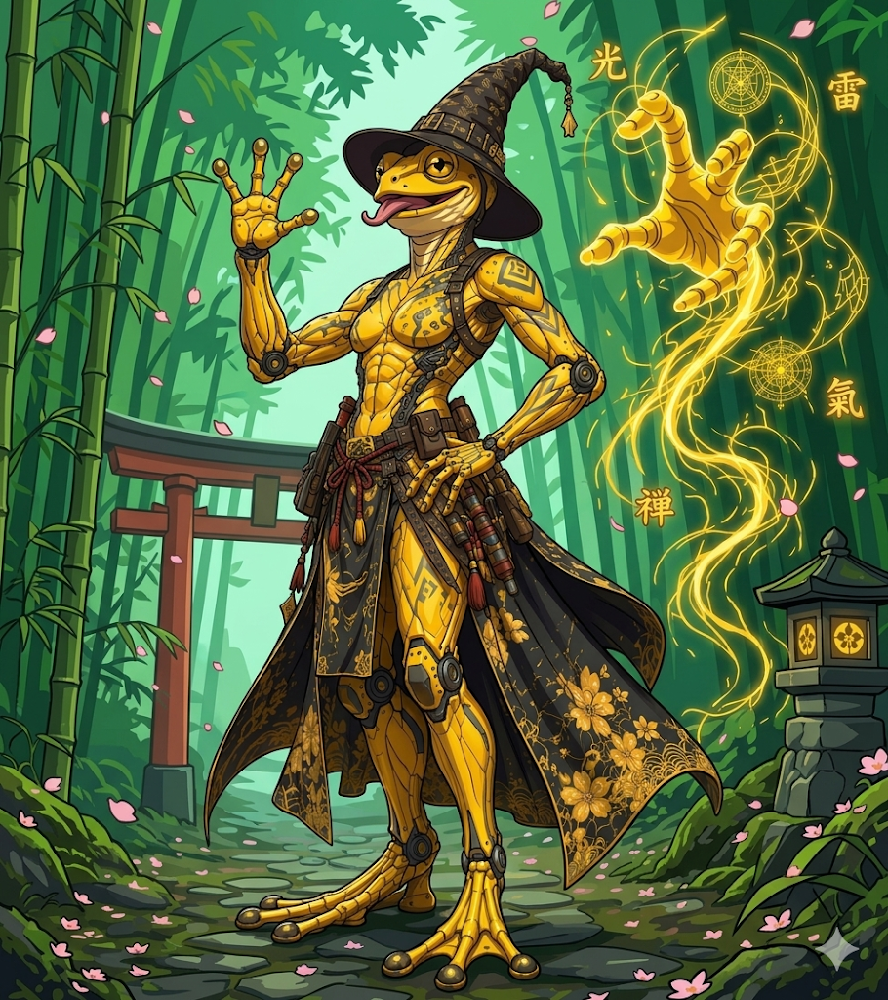

<header class="fiche-header">

  

<table class="info-table">
<tbody>

<tr>
<th>Race</th>
<td><a href="https://grimoire-shuji.org/races/kagerane/">Kagerane</a></td>

<th>Historique</th>
<td><a href="https://www.aidedd.org/regles/historiques/ermite/">Ermite</a></td>
</tr>

<tr>
<th>Classe</th>
<td><a href="https://www.aidedd.org/regles/classes/ensorceleur/">Ensorceleur</a></td>

<th>Sous-classe</th>
<td><a href="https://www.aidedd.org/regles/classes/ensorceleur/#sauvage">Magie Sauvage</a></td>
</tr>

<tr>

<th>Bonus maîtrise</th>
<td>+2</td>

<th>Niveau</th>
<td>2</td>
</tr>

</tbody>
</table>

  

  

    
  

</header>

<table class="abilities-table">
  <thead>
    <tr>
      <th>Force</th>
      <th>Dextérité</th>
      <th>Constitution</th>
      <th>Intelligence</th>
      <th>Sagesse</th>
      <th>Charisme</th>
    </tr>
  </thead>

  <tbody>

<tr class="mod-row">
     <td><strong>-1</strong></td>
     <td><strong>+0</strong></td>
     <td><strong>+2</strong></td>
     <td><strong>+2</strong></td>
     <td><strong>+1</strong></td>
     <td><strong>+4</strong></td>
</tr>

<tr class="score-row">
     <td>8</td>
     <td>10</td>
     <td>14</td>
     <td>14</td>
     <td>12</td>
     <td>18</td>
</tr>

  </tbody>
</table>

<section class="fiche-grid">

<h2>Combat</h2>

<table class="compact-table">
<tbody>
<tr><th>Classe d’armure</th><td>10</td></tr>
<tr><th>Initiative</th><td>+0</td></tr>
<tr><th>Vitesse</th><td>9 m</td></tr>
<tr><th>PV max</th><td>14</td></tr>
<tr><th>PV actuels</th><td>1</td></tr>
<tr><th>Dés de vie</th><td>2d6</td></tr>
</tbody>
</table>

<h2>Sauvegardes</h2>

<table class="compact-table">
<tbody>
<tr><th>○ Force</th><td>-1</td></tr>
<tr><th>○ Dextérité</th><td>+0</td></tr>
<tr><th>● Constitution</th><td>+4</td></tr>
<tr><th>○ Intelligence</th><td>+2</td></tr>
<tr><th>○ Sagesse</th><td>+1</td></tr>
<tr><th>● Charisme</th><td>+6</td></tr>
</tbody>
</table>

<h2>Sens</h2>

<table class="compact-table">
<tbody>
<tr><th>Perception passive</th><td>11</td></tr>
<tr><th>Investigation passive</th><td>12</td></tr>
<tr><th>Intuition passive</th><td>11</td></tr>
<tr><th>Vision dans le noir</th><td>—</td></tr>
</tbody>
</table>

<h2>Compétences</h2>

<table class="skills-table">
<tbody>
<tr>
<th>○ Acrobaties <em>Dex</em></th><td>+0</td>
<th>● Arcanes <em>Int</em></th><td>+4</td>
<th>○ Athlétisme <em>For</em></th><td>-1</td>
</tr>
<tr>
<th>● Discrétion <em>Dex</em></th><td>+2</td>
<th>○ Dressage <em>Sag</em></th><td>+1</td>
<th>○ Escamotage <em>Dex</em></th><td>+0</td>
</tr>
<tr>
<th>○ Histoire <em>Int</em></th><td>+2</td>
<th>○ Intimidation <em>Cha</em></th><td>+4</td>
<th>○ Intuition <em>Sag</em></th><td>+1</td>
</tr>
<tr>
<th>○ Investigation <em>Int</em></th><td>+2</td>
<th>● Médecine <em>Sag</em></th><td>+3</td>
<th>○ Nature <em>Int</em></th><td>+2</td>
</tr>
<tr>
<th>○ Perception <em>Sag</em></th><td>+1</td>
<th>● Persuasion <em>Cha</em></th><td>+6</td>
<th>● Religion <em>Int</em></th><td>+4</td>
</tr>
<tr>
<th>○ Représentation <em>Cha</em></th><td>+4</td>
<th>○ Survie <em>Sag</em></th><td>+1</td>
<th>○ Tromperie <em>Cha</em></th><td>+4</td>
</tr>
</tbody>
</table>

<h2>Attaques & sorts mineurs</h2>

<table class="wide-table">
<thead>
<tr><th>Nom</th><th>Bonus</th><th>Dégâts</th><th>Notes</th></tr>
</thead>
<tbody>
<tr><td>Arbalète légère</td><td>+2</td><td>1d8 perforant</td><td>Attaque à distance</td></tr>
<tr><td>Dague</td><td>+2</td><td>1d4 perforant</td><td>Arme légère</td></tr>
</tbody>
</table>

<h2>Sorts</h2>

<table class="spellcasting-table">
<tbody>
<tr>
<th>Caractéristique d’incantation</th>
<td>Charisme</td>
<th>Sorts / jour</th>
<td>--</td>
<th>Emplacements de sorts</th>
<td>2</td>
</tr>
<tr>
<th>Modificateur</th>
<td>+4</td>
<th>DD des sorts</th>
<td>14</td>
<th>Bonus d’attaque</th>
<td>+6</td>
</tr>
</tbody>
</table>

 
<table class="spells-table">
<thead>
<tr>
<th>Niveau</th>
<th>Nom</th>
<th>Temps d’incantation</th>
<th>Portée</th>
<th>Concentration</th>
<th>Rituel</th>
<th>Matériel</th>
<th>Notes</th>
</tr>
</thead>
<tbody>
<tr>
<td>0</td>
<td><a href="../sorts/niveau-0/lumiere.md">Lumière</a></td>
<td>1 action</td>
<td>Contact</td>
<td>❌</td>
<td>❌</td>
<td>❌</td>
<td>Dure 1 heure</td>
</tr>
<tr>
<td>0</td>
<td><a href="../sorts/niveau-0/main-de-mage.md">Main de mage</a></td>
<td>1 action</td>
<td>9 m</td>
<td>❌</td>
<td>❌</td>
<td>❌</td>
<td>Dure 1 min</td>
</tr>
<tr>
<td>0</td>
<td><a href="../sorts/niveau-0/message.md">Message</a></td>
<td>1 action</td>
<td>36 m</td>
<td>❌</td>
<td>❌</td>
<td>❌</td>
<td>Dure 1 tour</td>
</tr>
<tr>
<td>0</td>
<td><a href="../sorts/niveau-0/rayon-de-givre.md">Rayon de Givre</a></td>
<td>1 action</td>
<td>18 m</td>
<td>❌</td>
<td>❌</td>
<td>❌</td>
<td>Instantané</td>
</tr>
<tr>
<td>1</td>
<td><a href="../sorts/niveau-1/armure-de-mage.md">Armure de Mage</a></td>
<td>1 action</td>
<td>Contact</td>
<td>❌</td>
<td>❌</td>
<td>❌</td>
<td>Dure 8 heures</td>
</tr>
<tr>
<td>1</td>
<td><a href="../sorts/niveau-1/couteau-de-glace.md">Couteau de Glace</a></td>
<td>1 action</td>
<td>18 m</td>
<td>❌</td>
<td>❌</td>
<td>❌</td>
<td>Instantané</td>
</tr>
<tr>
<td>1</td>
<td><a href="../sorts/niveau-1/orbe-chromatique.md">Orbe Chromatique</a></td>
<td>1 action</td>
<td>27 m</td>
<td>❌</td>
<td>❌</td>
<td>❌</td>
<td>Instantané</td>
</tr>
</tbody>
</table>

<h2>Équipement</h2>

<table class="wide-table">
<thead>
<tr><th>Objet</th><th>Quantité</th><th>Notes</th></tr>
</thead>
<tbody>
<tr><td>Arbalète légère</td><td>1</td><td>Équipée</td></tr>
<tr><td>Carreaux</td><td>20</td><td>Munitions</td></tr>
<tr><td>Dagues</td><td>2</td><td>Armes légères</td></tr>
<tr><td>Dague courbe</td><td>1</td><td>—</td></tr>
<tr><td>Kit d’herboriste</td><td>1</td><td>Outil</td></tr>
</tbody>
</table>

<h2>Traits d’espèce</h2>

<table class="compact-table">
<tbody>
<tr><th>Escalade</th><td>9 m</td></tr>
<tr><th>Nage</th><td>12 m</td></tr>
<tr><th>Amphibie</th><td>Oui</td></tr>
<tr><th>Dépendance à l’eau</th><td>Oui</td></tr>
</tbody>
</table>

<h2>Capacités</h2>

<table class="text-table">
<tbody>
<tr><th>Marée du chaos</th></tr>
<tr><td>Vous pouvez manipuler les forces du hasard pour gagner un avantage à un jet d’attaque, de caractéristique ou de sauvegarde.</td></tr>
<tr><th>Talents</th></tr>
<tr><td>Action bonus : foncer, se désengager, esquiver, se cacher. Points vitaux : indique où toucher avant de lancer l’attaque.</td></tr>
</tbody>
</table>

<h2>Richesses</h2>

<table class="compact-table">
<tbody>
<tr><th>PC</th><td>0</td></tr>
<tr><th>PA</th><td>0</td></tr>
<tr><th>PE</th><td>0</td></tr>
<tr><th>PO</th><td>5</td></tr>
<tr><th>PP</th><td>0</td></tr>
</tbody>
</table>

</section>

