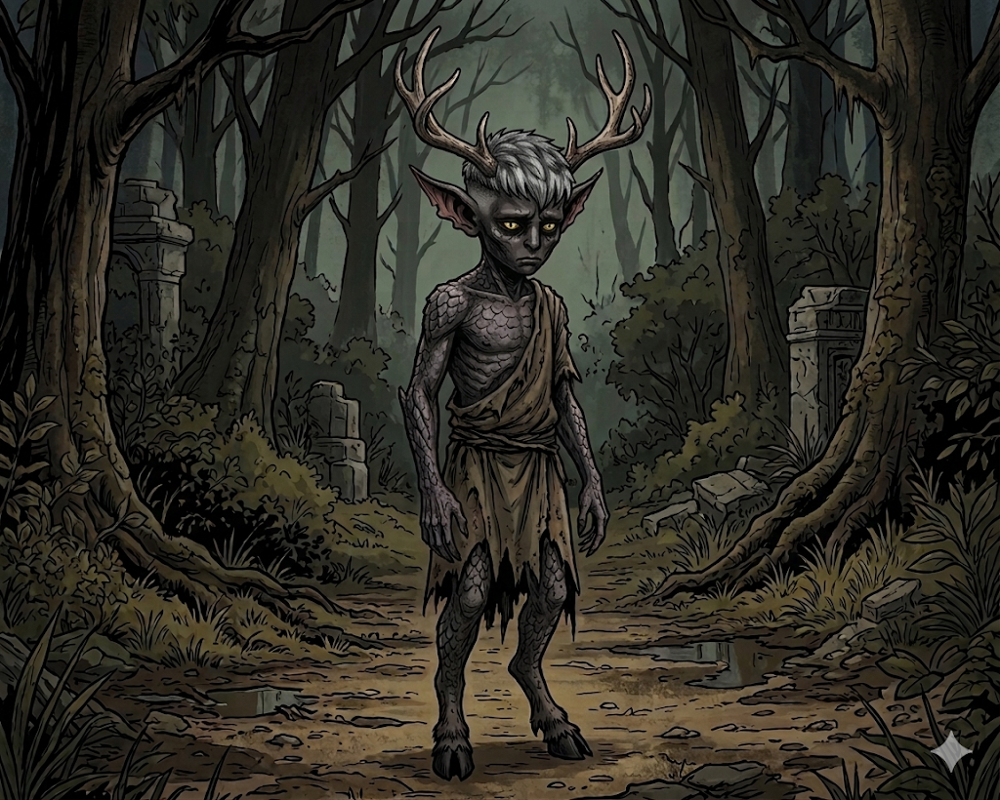

<header class="fiche-header">
  

  <table class="info-table">
<tbody>
<tr>
<th>Race</th>
<td><a href="https://grimoire-shuji.org/races/enfantmaudit/">Enfant maudit</a></td>
<th>Historique</th>
<td><a href="https://www.aidedd.org/regles/historiques/artisan-de-guilde/">Artisan de guilde</a></td>
</tr>
<tr>
<th>Classe</th>
<td><a href="https://www.aidedd.org/regles/classes/rodeur/">Rôdeur</a></td>
<th>Sous-classe</th>
<td><a href="https://www.aidedd.org/dnd-5/unearthed-arcana/archetypes-de-rodeur/#drake">Gardien de drake</a></td>
</tr>
<tr>
<th>Bonus maîtrise</th>
<td>+2</td>
<th>Niveau</th>
<td>2</td>
</tr>
</tbody>
</table>
  

    

    
  

  </header>
<table class="abilities-table">
<thead>
<tr>
<th>Force</th>
<th>Dextérité</th>
<th>Constitution</th>
<th>Intelligence</th>
<th>Sagesse</th>
<th>Charisme</th>
</tr>
</thead>
<tbody>
<tr class="mod-row">
<td><strong>+0</strong></td>
<td><strong>+3</strong></td>
<td><strong>+2</strong></td>
<td><strong>+1</strong></td>
<td><strong>+2</strong></td>
<td><strong>-1</strong></td>
</tr>
<tr class="score-row">
<td>10</td>
<td>17</td>
<td>14</td>
<td>13</td>
<td>15</td>
<td>8</td>
</tr>
</tbody>
</table>
<section class="fiche-grid">

<h2>Combat</h2>
<table class="compact-table">
<tbody>
<tr><th>Classe d’armure</th><td>14</td></tr>
<tr><th>Initiative</th><td>+3</td></tr>
<tr><th>Vitesse</th><td>7,5 m</td></tr>
<tr><th>PV max</th><td>19</td></tr>
<tr><th>PV actuels</th><td>11</td></tr>
<tr><th>Dés de vie</th><td>2d10</td></tr>
</tbody>
</table>

<h2>Sauvegardes</h2>
<table class="compact-table">
<tbody>
<tr><th>● Force</th><td>+2</td></tr>
<tr><th>● Dextérité</th><td>+5</td></tr>
<tr><th>○ Constitution</th><td>+2</td></tr>
<tr><th>○ Intelligence</th><td>+1</td></tr>
<tr><th>○ Sagesse</th><td>+2</td></tr>
<tr><th>○ Charisme</th><td>-1</td></tr>
</tbody>
</table>

<h2>Sens</h2>
<table class="compact-table">
<tbody>
<tr><th>Perception passive</th><td>12</td></tr>
<tr><th>Investigation passive</th><td>11</td></tr>
<tr><th>Intuition passive</th><td>14</td></tr>
<tr><th>Vision dans le noir</th><td>18 m</td></tr>
</tbody>
</table>

<h2>Compétences</h2>
<table class="skills-table">
<tbody>
<tr>
<th>○ Acrobaties <em>Dex</em></th><td>+3</td>
<th>○ Arcanes <em>Int</em></th><td>+1</td>
<th>○ Athlétisme <em>For</em></th><td>+0</td>
</tr>
<tr>
<th>● Discrétion <em>Dex</em></th><td>+5</td>
<th>● Dressage <em>Sag</em></th><td>+4</td>
<th>○ Escamotage <em>Dex</em></th><td>+3</td>
</tr>
<tr>
<th>○ Histoire <em>Int</em></th><td>+1</td>
<th>○ Intimidation <em>Cha</em></th><td>-1</td>
<th>● Intuition <em>Sag</em></th><td>+4</td>
</tr>
<tr>
<th>○ Investigation <em>Int</em></th><td>+1</td>
<th>○ Médecine <em>Sag</em></th><td>+2</td>
<th>○ Nature <em>Int</em></th><td>+1</td>
</tr>
<tr>
<th>● Perception <em>Sag</em></th><td>+4</td>
<th>● Persuasion <em>Cha</em></th><td>+1</td>
<th>○ Religion <em>Int</em></th><td>+1</td>
</tr>
<tr>
<th>○ Représentation <em>Cha</em></th><td>-1</td>
<th>○ Survie <em>Sag</em></th><td>+2</td>
<th>○ Tromperie <em>Cha</em></th><td>-1</td>
</tr>
</tbody>
</table>

<h2>Attaques & sorts</h2>
<table class="wide-table">
<thead>
<tr><th>Nom</th><th>Bonus</th><th>Dégâts</th><th>Notes</th></tr>
</thead>
<tbody>
<tr>
<td>Dague</td>
<td>+5</td>
<td>1d4 perforant</td>
<td>Finesse, légère, lancer (6/18 m)</td>
</tr>
<tr>
<td>Dague</td>
<td>+5</td>
<td>1d4 perforant</td>
<td>Seconde dague</td>
</tr>
<tr>
<td>Arc long</td>
<td>+5</td>
<td>1d8 perforant</td>
<td>Portée 45/180 m, lourde, deux mains</td>
</tr>
</tbody>
</table>

<h2>Sorts</h2>
<table class="spellcasting-table">
<tbody>
<tr>
<th>Caractéristique d’incantation</th>
<td>Sagesse</td>
<th>Sorts préparés</th>
<td>2</td>
<th>Emplacements de sorts</th>
<td>2 (niv.1)</td>
</tr>
<tr>
<th>Modificateur</th>
<td>+2</td>
<th>DD des sorts</th>
<td>12</td>
<th>Bonus d’attaque</th>
<td>+4</td>
</tr>
</tbody>
</table>
 
<table class="spells-table">
<thead>
<tr>
<th>Niveau</th>
<th>Nom</th>
<th>Temps</th>
<th>Portée</th>
<th>Concentration</th>
<th>Rituel</th>
<th>Matériel</th>
<th>Notes</th>
</tr>
</thead>
<tbody>
<tr>
<td>1</td>
<td><a href="../sorts/niveau-1/frappe-piegeuse.md">Frappe piégeuse</a></td>
<td>1 action bonus</td>
<td>Personnelle</td>
<td>✅</td>
<td>❌</td>
<td>❌</td>
<td>Entrave la cible et inflige 1d6 perforant par tour.</td>
</tr>
<tr>
<td>1</td>
<td><a href="../sorts/niveau-1/collet.md">Collet</a></td>
<td>1 minute</td>
<td>Contact</td>
<td>❌</td>
<td>❌</td>
<td>✅</td>
<td>Piège magique immobilisant.</td>
</tr>
</tbody>
</table>

<h2>Équipement</h2>
<table class="wide-table">
<thead>
<tr>
<th>Objet</th>
<th>Qté</th>
<th>Notes</th>
</tr>
</thead>
<tbody>
<tr><td>Armure de cuir</td><td>1</td><td>Équipée</td></tr>
<tr><td>Dague</td><td>2</td><td>Corps à corps</td></tr>
<tr><td>Arc long</td><td>1</td><td>Équipé</td></tr>
<tr><td>Carquois</td><td>1</td><td>Flèches</td></tr>
<tr><td>Sac d'explorateur</td><td>1</td><td>—</td></tr>
<tr><td>Dague obsidienne runique</td><td>1</td><td>Runes (combat saison 0)</td></tr>
</tbody>
</table>

<h2>Maîtrises</h2>
<table class="compact-table">
<tbody>
<tr>
<th>Armes</th>
<td>Armes courantes, armes de guerre</td>
</tr>
<tr>
<th>Armures</th>
<td>Armures légères, intermédiaires, boucliers</td>
</tr>
<tr>
<th>Outils</th>
<td>—</td>
</tr>
<tr>
<th>Langues</th>
<td>Commun, Infernal, Nain</td>
</tr>
</tbody>
</table>

<h2>Traits d'espèce</h2>
<table class="text-table">
<tbody>
<tr><th>Âge</th></tr>
<tr>
<td>
Vous ne subissez pas les effets de la vieillesse et êtes immunisé contre le vieillissement magique.
Vous conservez l'apparence d'un enfant jusqu'à votre mort.
</td>
</tr>
<tr><th>Vision dans le noir</th></tr>
<tr>
<td>
Vision dans l'obscurité jusqu'à 18 mètres.
Les couleurs sont perçues en nuances de gris.
</td>
</tr>
<tr><th>Esprit inaltérable</th></tr>
<tr>
<td>
Avantage aux jets de sauvegarde contre les sorts de l'école d'Enchantement.
</td>
</tr>
<tr><th>Aura repoussante</th></tr>
<tr>
<td>
Votre présence inspire le malaise.
Vous obtenez la maîtrise de Tromperie ou Intimidation.
</td>
</tr>
<tr><th>Apogée : Forme démoniaque terrifiante</th></tr>
<tr>
<td>
À partir du niveau 5, vous pouvez révéler votre véritable nature démoniaque pendant 1 minute.
Les créatures hostiles dans un rayon de 9 m doivent réussir un jet de Sagesse sous peine d'être Effrayées.
Vos attaques infligent également des dégâts nécrotiques supplémentaires égaux à votre niveau.
Utilisable une fois par repos long.
</td>
</tr>
</tbody>
</table>

<h2>Capacités</h2>
<table class="text-table">
<tbody>
<tr><th>Ennemi juré</th></tr>
<tr>
<td>
Ennemi choisi : <strong>Morts-vivants</strong>.
<ul>
<li>+2 dégâts contre cette catégorie.</li>
<li>Avantage en Survie pour les pister.</li>
<li>Avantage en Intelligence pour obtenir des informations.</li>
<li>Apprentissage d'une langue de leur choix.</li>
</ul>
</td>
</tr>
<tr><th>Explorateur-né</th></tr>
<tr>
<td>
<ul>
<li>Ignore les terrains difficiles.</li>
<li>Avantage à l'initiative.</li>
<li>Avantage aux attaques lors du premier tour contre les créatures n'ayant pas encore agi.</li>
<li>Le groupe ne se perd pas.</li>
<li>Déplacements discrets en voyage.</li>
<li>Trouve deux fois plus de nourriture.</li>
<li>Obtient davantage d'informations lors du pistage.</li>
</ul>
</td>
</tr>
<tr><th>Style de combat : Archerie</th></tr>
<tr>
<td>
+2 aux jets d'attaque avec les armes à distance.
</td>
</tr>
</tbody>
</table>

<h2>Talents</h2>
<table class="text-table">
<tbody>
<tr>
<th>Points vitaux</th>
</tr>
<tr>
<td>
<strong>Action bonus.</strong>
Après avoir utilisé une action pour attaquer, vous pouvez utiliser une action bonus afin de renforcer votre attaque.
Si celle-ci touche, vous choisissez la partie du corps atteinte.
Le MD applique alors un effet adapté à la créature et à l'attaque.
Exemples :
<ul>
<li>La cible lâche son arme.</li>
<li>La cible ne peut plus se déplacer.</li>
<li>La cible perd une capacité ou un passif.</li>
<li>La cible perd la vue.</li>
<li>La cible est désorientée.</li>
<li>La cible perd sa concentration.</li>
</ul>
Les effets sont laissés à l'appréciation du MD.
Nombre d'utilisations : <strong>égal au bonus de maîtrise.</strong>
</td>
</tr>
<tr>
<th>Connaissance</th>
</tr>
<tr>
<td>
Vous obtenez une connaissance précise sur un sujet.
Selon la complexité du sujet, le MJ fournit davantage d'informations.
Cette capacité ne peut pas servir à obtenir directement des renseignements sur un personnage ou une créature liée à la campagne.
Exemples :
<ul>
<li>Informations sur un type de créature.</li>
<li>Informations sur une divinité.</li>
<li>Informations sur une région.</li>
<li>Informations sur une magie.</li>
</ul>
</td>
</tr>
</tbody>
</table>

<h2>Personnalité</h2>
<table class="text-table">
<tbody>
<tr>
<th>Trait de personnalité</th>
</tr>
<tr>
<td>
Chaleureux avec les autres, mais cherche toujours le meilleur moyen d'obtenir davantage de renommée.
</td>
</tr>
<tr>
<th>Idéal</th>
</tr>
<tr>
<td>
Les autres ne sont que des outils.
</td>
</tr>
<tr>
<th>Défaut</th>
</tr>
<tr>
<td>
Aucun défaut particulier renseigné.
</td>
</tr>
<tr>
<th>Liens</th>
</tr>
<tr>
<td>
Aucun.
</td>
</tr>
</tbody>
</table>
 
<h2>Apparence</h2>
<table class="text-table">
<tbody>
<tr>
<td>
<strong>Le Réprouvé (Destin Démoniaque)</strong>
  
Petit humanoïde à l'apparence d'un enfant malgré ses 114 années d'existence.
Son origine maudite laisse transparaître une aura inquiétante et dérangeante qui met instinctivement les autres mal à l'aise.
</td>
</tr>
</tbody>
</table>
 
<h2>Richesses</h2>
<table class="compact-table">
<tbody>
<tr><th>PC</th><td>0</td></tr>
<tr><th>PA</th><td>0</td></tr>
<tr><th>PE</th><td>0</td></tr>
<tr><th>PO</th><td>15</td></tr>
<tr><th>PP</th><td>0</td></tr>
</tbody>
</table>

<h2>Informations</h2>
<table class="compact-table">
<tbody>
<tr><th>Alignement</th><td>Mauvais chaotique</td></tr>
<tr><th>Genre</th><td>Masculin</td></tr>
<tr><th>Âge</th><td>114 ans</td></tr>
<tr><th>Taille</th><td>130 cm</td></tr>
<tr><th>Poids</th><td>35 kg</td></tr>
</tbody>
</table>

</section>

