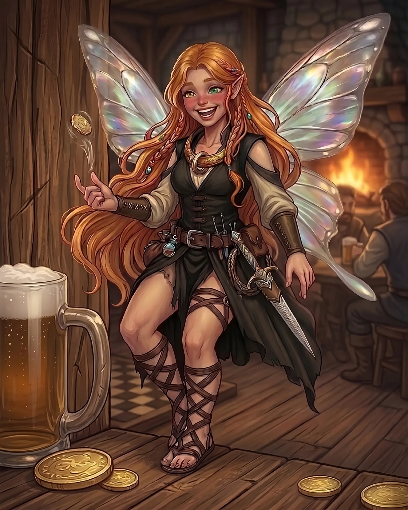

<header class="fiche-header">

  

<table class="info-table">
<tbody>

<tr>
<th>Race</th>
<td><a href="https://grimoire-shuji.org/races/lepidien/">Lépidien de jour</a></td>

<th>Historique</th>
<td><a href="https://www.aidedd.org/regles/historiques/charlatan/">Charlatan</a></td>
</tr>

<tr>
<th>Classe</th>
<td><a href="https://www.aidedd.org/regles/classes/roublard/">Roublard</a></td>

<th>Sous-classe</th>
<td>—</td>
</tr>

<tr>

<th>Bonus maîtrise</th>
<td>+2</td>

<th>Niveau</th>
<td>2</td>
</tr>

</tbody>
</table>

  

  

    
  

</header>

<table class="abilities-table">
<thead>
<tr>
<th>Force</th>
<th>Dextérité</th>
<th>Constitution</th>
<th>Intelligence</th>
<th>Sagesse</th>
<th>Charisme</th>
</tr>
</thead>

<tbody>

<tr class="mod-row">
<td><strong>-1</strong></td>
<td><strong>+4</strong></td>
<td><strong>+0</strong></td>
<td><strong>+3</strong></td>
<td><strong>+1</strong></td>
<td><strong>+1</strong></td>
</tr>

<tr class="score-row">
<td>8</td>
<td>18</td>
<td>10</td>
<td>16</td>
<td>12</td>
<td>12</td>
</tr>

</tbody>
</table>

<section class="fiche-grid">

<h2>Combat</h2>

<table class="compact-table">
<tbody>
<tr><th>Classe d’armure</th><td>15</td></tr>
<tr><th>Initiative</th><td>+4</td></tr>
<tr><th>Vitesse</th><td>9 m (sol & vol)</td></tr>
<tr><th>PV max</th><td>12</td></tr>
<tr><th>PV actuels</th><td>12</td></tr>
<tr><th>Dés de vie</th><td>2d8</td></tr>
</tbody>
</table>

<h2>Sauvegardes</h2>

<table class="compact-table">
<tbody>
<tr><th>○ Force</th><td>-1</td></tr>
<tr><th>● Dextérité</th><td>+6</td></tr>
<tr><th>○ Constitution</th><td>+0</td></tr>
<tr><th>● Intelligence</th><td>+5</td></tr>
<tr><th>○ Sagesse</th><td>+1</td></tr>
<tr><th>○ Charisme</th><td>+1</td></tr>
</tbody>
</table>

<h2>Sens</h2>

<table class="compact-table">
<tbody>
<tr><th>Perception passive</th><td>13</td></tr>
<tr><th>Investigation passive</th><td>13</td></tr>
<tr><th>Intuition passive</th><td>13</td></tr>
<tr><th>Vision dans le noir</th><td>—</td></tr>
</tbody>
</table>

<h2>Compétences</h2>

<table class="skills-table">
<tbody>

<tr>
<th>● Acrobaties <em>Dex</em></th><td>+6</td>
<th>○ Arcanes <em>Int</em></th><td>+3</td>
<th>○ Athlétisme <em>For</em></th><td>-1</td>
</tr>

<tr>
<th>◆ Discrétion <em>Dex</em></th><td>+8</td>
<th>○ Dressage <em>Sag</em></th><td>+1</td>
<th>◆ Escamotage <em>Dex</em></th><td>+8</td>
</tr>

<tr>
<th>○ Histoire <em>Int</em></th><td>+3</td>
<th>○ Intimidation <em>Cha</em></th><td>+1</td>
<th>● Intuition <em>Sag</em></th><td>+3</td>
</tr>

<tr>
<th>○ Investigation <em>Int</em></th><td>+3</td>
<th>○ Médecine <em>Sag</em></th><td>+1</td>
<th>○ Nature <em>Int</em></th><td>+3</td>
</tr>

<tr>
<th>● Perception <em>Sag</em></th><td>+3</td>
<th>● Persuasion <em>Cha</em></th><td>+3</td>
<th>○ Religion <em>Int</em></th><td>+3</td>
</tr>

<tr>
<th>○ Représentation <em>Cha</em></th><td>+1</td>
<th>○ Survie <em>Sag</em></th><td>+1</td>
<th>● Tromperie <em>Cha</em></th><td>+3</td>
</tr>

</tbody>
</table>

<h2>Attaques</h2>

<table class="wide-table">
<thead>
<tr><th>Nom</th><th>Bonus</th><th>Dégâts</th><th>Notes</th></tr>
</thead>

<tbody>

<tr>
<td>Dague</td>
<td>+6</td>
<td>1d4+4 perforant</td>
<td>Finesse, légère, lancer (6/18 m)</td>
</tr>

<tr>
<td>Arc court</td>
<td>+6</td>
<td>1d6+4 perforant</td>
<td>Portée (24/96 m), deux mains</td>
</tr>

</tbody>
</table>

<h2>Équipement</h2>

<table class="wide-table">
<thead>
<tr><th>Objet</th><th>Quantité</th><th>Notes</th></tr>
</thead>

<tbody>

<tr><td>Dagues-ciseaux</td><td>2</td><td>Une pour chaque lame de ciseau</td></tr>
<tr><td>Arc court</td><td>1</td><td>Équipé</td></tr>
<tr><td>Flèches</td><td>20</td><td>Carquois</td></tr>
<tr><td>Armure de cuir</td><td>1</td><td>Équipée</td></tr>
<tr><td>Sac de cambrioleur</td><td>1</td><td>Kit d'aventure</td></tr>
<tr><td>Outils de voleur</td><td>1</td><td>Outil</td></tr>
<tr><td>Fleurs de lueur nocturne</td><td>4</td><td>Composants</td></tr>
<tr><td>Vêtements fins</td><td>1</td><td>—</td></tr>
<tr><td>Kit de déguisement</td><td>1</td><td>Outil</td></tr>
<tr><td>Outils d'escroquerie</td><td>1</td><td>Dés truqués, cartes marquées, bouteilles bouchonnées, fausse chevalière…</td></tr>
<tr><td>Bourse</td><td>1</td><td>—</td></tr>
<tr><td>Rations de voyage</td><td>2</td><td>—</td></tr>
<tr><td>Vin doux</td><td>1</td><td>—</td></tr>

</tbody>
</table>

<h2>Traits d'espèce</h2>

<table class="text-table">
<tbody>

<tr><th>Ailes délicates</th></tr>
<tr>
<td>
Vous possédez des ailes majestueuses qui vous confèrent une vitesse de vol de 9 mètres.
Vous ne pouvez pas utiliser cette vitesse de vol si vous portez une armure intermédiaire ou lourde.
</td></tr>

<tr><th>Antennes sensorielles</th></tr>
<tr>
<td>
Vos antennes perçoivent les changements infimes des courants d'air.
Vous maîtrisez la compétence <strong>Perception</strong>.
</td></tr>

<tr><th>Poussière d'illusion</th></tr>
<tr>
<td>
Vous connaissez le tour de magie <em>Illusion mineure</em>.
À partir du niveau 3, vous pouvez lancer <em>Image miroir</em> sur vous-même une fois par repos long sans composantes matérielles.
</td></tr>

</tbody>
</table>
 
<h2>Maîtrises</h2>

<table class="compact-table">
<tbody>

<tr><th>Armes</th><td>Armes courantes, arbalète de poing, épée courte, épée longue, rapière</td></tr>

<tr><th>Armures</th><td>Armures légères</td></tr>

<tr><th>Outils</th><td>Kit de contrefaçons, kit de déguisement, outils de voleur</td></tr>

<tr><th>Langues</th><td>Commun, Sylvestre</td></tr>

</tbody>
</table>

<h2>Capacités</h2>

<table class="text-table">
<tbody>

<tr><th>Expertise</th></tr>
<tr>
<td>
Les compétences <strong>Discrétion</strong> et <strong>Escamotage</strong> bénéficient de l'expertise.
</td></tr>

<tr><th>Attaque sournoise</th></tr>
<tr>
<td>
Une fois par tour, ajoutez <strong>1d6 dégâts</strong> avec une arme de finesse ou à distance si vous avez l'avantage ou si un allié est adjacent à la cible.
</td></tr>

<tr><th>Jargon des voleurs</th></tr>
<tr>
<td>
Compréhension et transmission de messages codés ainsi que des signes et symboles secrets des voleurs.
</td></tr>

<tr><th>Ruse</th></tr>
<tr>
<td>
À chaque tour, vous pouvez utiliser votre action bonus pour :
<ul>
<li>Se désengager</li>
<li>Se cacher</li>
<li>Foncer</li>
</ul>
</td></tr>

<tr><th>Arbre de talents — Donjons &amp; Gloutons</th></tr>
<tr>
<td>

Après avoir mangé un repas copieux (double ration), vous obtenez jusqu'au prochain repos long :

<ul>
<li>PV temporaires = Mod. Constitution + Niveau + Bonus de maîtrise</li>
<li>+1,5 m de vitesse</li>
<li>+1 à l'initiative</li>
<li>+2 en Survie</li>
<li>+2 en Persuasion</li>
<li>Avantage pour trouver de la nourriture</li>
</ul>

</td></tr>

</tbody>
</table>

<h2>Apparence</h2>

<table class="text-table">
<tbody>

<tr><td>

<ul>
<li>Cheveux roux longs, souvent tressés</li>
<li>Yeux vairons verts et jaunes</li>
<li>Peau pâle et lisse, joues et fossettes rougies par la boisson et la joie</li>
<li>Oreilles pointues et gracieuses</li>
<li>Ailes de papillon aux reflets perlés d'un prisme</li>
</ul>

</td></tr>

</tbody>
</table>
 
<h2>Personnalité</h2>

<table class="text-table">
<tbody>

<tr><th>Trait de personnalité</th></tr>
<tr>
<td>
Joueuse dans l'âme, n'hésite pas à prendre des risques pour un gain potentiel.
</td>
</tr>

<tr><th>Défaut</th></tr>
<tr>
<td>
Perd un peu la tête lorsqu'elle reste enfermée trop longtemps dans l'anneau et se parle à elle-même.
</td>
</tr>

</tbody>
</table>
 
<h2>Richesses</h2>

<table class="compact-table">
<tbody>

<tr><th>PC</th><td>15</td></tr>
<tr><th>PA</th><td>0</td></tr>
<tr><th>PE</th><td>0</td></tr>
<tr><th>PO</th><td>31</td></tr>
<tr><th>PP</th><td>0</td></tr>

</tbody>
</table>

<h2>Sorts raciaux</h2>

<table class="spells-table">

<thead>
<tr>
<th>Niveau</th>
<th>Nom</th>
<th>Temps d'incantation</th>
<th>Portée</th>
<th>Concentration</th>
<th>Rituel</th>
<th>Matériel</th>
<th>Notes</th>
</tr>
</thead>

<tbody>

<tr>
<td>0</td>
<td><a href="../sorts/niveau-0/illusion-mineure.md">Illusion mineure</a></td>
<td>1 action</td>
<td>9 m</td>
<td>❌</td>
<td>❌</td>
<td>❌</td>
<td>Trait racial</td>
</tr>

<tr>
<td>2</td>
<td><a href="../sorts/niveau-2/image-miroir.md">Image miroir</a></td>
<td>1 action</td>
<td>Personnel</td>
<td>❌</td>
<td>❌</td>
<td>❌</td>
<td>À partir du niveau 3, 1 fois par repos long via Poussière d'illusion.</td>
</tr>

</tbody>

</table>

<h2>Notes</h2>

<table class="text-table">
<tbody>

<tr><th>Historique</th></tr>

<tr>
<td>

<strong>Combine préférée :</strong> 

Convaincre les gens qu'une camelote vaut largement l'argent demandé.

</td>
</tr>

<tr><th>Fausse identité</th></tr>

<tr>
<td>

Vous disposez d'une fausse identité complète comprenant :

<ul>
<li>Documents officiels</li>
<li>Relations établies</li>
<li>Matériel de maquillage</li>
<li>Possibilité de contrefaire des documents déjà observés</li>
</ul>

</td>
</tr>

</tbody>
</table>

<h2>Informations</h2>

<table class="compact-table">
<tbody>

<tr><th>Alignement</th><td>Chaotique Bon</td></tr>
<tr><th>Genre</th><td>Féminin</td></tr>
<tr><th>Âge</th><td>17 ans</td></tr>
<tr><th>Taille</th><td>30 cm</td></tr>
<tr><th>Poids</th><td>6 kg</td></tr>

</tbody>
</table>

</section>

