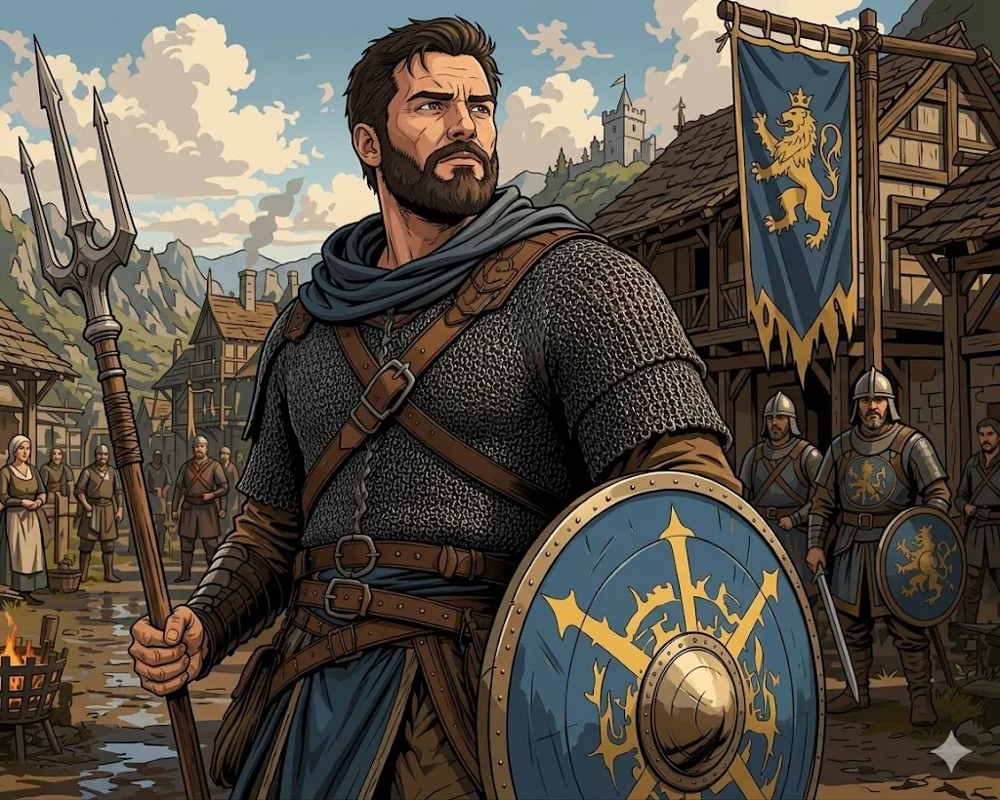

<header class="fiche-header">

  

<table class="info-table">
<tbody>

<tr>
<th>Race</th>
<td>Humain</td>

<th>Historique</th>
<td>Soldat</td>
</tr>

<tr>
<th>Classe</th>
<td>Guerrier</td>

<th>Sous-classe</th>
<td>—</td>
</tr>

<tr>
<th>Bonus maîtrise</th>
<td>+2</td>

<th>Niveau</th>
<td>2</td>
</tr>

</tbody>
</table>

  

  

    
  

</header>

<table class="abilities-table">
  <thead>
    <tr>
      <th>Force</th>
      <th>Dextérité</th>
      <th>Constitution</th>
      <th>Intelligence</th>
      <th>Sagesse</th>
      <th>Charisme</th>
   </tr>
 </thead>

  <tbody>

<tr class="mod-row">
     <td><strong>+3</strong></td>
     <td><strong>-1</strong></td>
     <td><strong>+3</strong></td>
     <td><strong>+0</strong></td>
     <td><strong>+1</strong></td>
     <td><strong>+2</strong></td>
</tr>

<tr class="score-row">
     <td>16</td>
     <td>8</td>
     <td>16</td>
     <td>10</td>
     <td>12</td>
     <td>14</td>
</tr>

 </tbody>
</table>

<section class="fiche-grid">

<h2>Combat</h2>

<table class="compact-table">
<tbody>
<tr><th>Classe d’armure</th><td>19</td></tr>
<tr><th>Initiative</th><td>-1</td></tr>
<tr><th>Vitesse</th><td>9m +3 → 12m</td></tr>
<tr><th>PV max</th><td>22</td></tr>
<tr><th>PV actuels</th><td>—</td></tr>
<tr><th>Dés de vie</th><td>1d10</td></tr>
</tbody>
</table>

<h2>Sauvegardes</h2>

<table class="compact-table">
<tbody>
<tr><th>● Force</th><td>+5</td></tr>
<tr><th>○ Dextérité</th><td>-1</td></tr>
<tr><th>● Constitution</th><td>+5</td></tr>
<tr><th>○ Intelligence</th><td>+0</td></tr>
<tr><th>○ Sagesse</th><td>+1</td></tr>
<tr><th>○ Charisme</th><td>+2</td></tr>
</tbody>
</table>

<h2>Sens</h2>

<table class="compact-table">
<tbody>
<tr><th>Perception passive</th><td>11</td></tr>
<tr><th>Investigation passive</th><td>—</td></tr>
<tr><th>Intuition passive</th><td>—</td></tr>
<tr><th>Vision dans le noir</th><td>—</td></tr>
</tbody>
</table>

<h2>Compétences</h2>

<table class="skills-table">
<tbody>
<tr>
<th>● Acrobaties <em>Dex</em></th><td>+1</td>
<th>○ Arcanes <em>Int</em></th><td>+0</td>
<th>● Athlétisme <em>For</em></th><td>+5</td>
</tr>
<tr>
<th>○ Discrétion <em>Dex</em></th><td>-1</td>
<th>○ Dressage <em>Sag</em></th><td>+1</td>
<th>○ Escamotage <em>Dex</em></th><td>-1</td>
</tr>
<tr>
<th>○ Histoire <em>Int</em></th><td>+0</td>
<th>● Intimidation <em>Cha</em></th><td>+4</td>
<th>○ Intuition <em>Sag</em></th><td>+1</td>
</tr>
<tr>
<th>○ Investigation <em>Int</em></th><td>+0</td>
<th>○ Médecine <em>Sag</em></th><td>+1</td>
<th>○ Nature <em>Int</em></th><td>+0</td>
</tr>
<tr>
<th>● Perception <em>Sag</em></th><td>+3</td>
<th>○ Persuasion <em>Cha</em></th><td>+2</td>
<th>○ Religion <em>Int</em></th><td>+0</td>
</tr>
<tr>
<th>○ Représentation <em>Cha</em></th><td>+2</td>
<th>● Survie <em>Sag</em></th><td>+3</td>
<th>○ Tromperie <em>Cha</em></th><td>+2</td>
</tr>
</tbody>
</table>

<h2>Attaques & sorts mineurs</h2>

<table class="wide-table">
<thead>
<tr><th>Nom</th><th>Bonus</th><th>Dégâts</th><th>Notes</th></tr>
</thead>
<tbody>
<tr><td>Trident</td><td>+5</td><td>1d6+3 perforant</td><td>—</td></tr>
<tr><td>Corps à corps</td><td>—</td><td>—</td><td>—</td></tr>
</tbody>
</table>

<h2>Équipement</h2>

<table class="wide-table">
<thead>
<tr><th>Objet</th><th>Quantité</th><th>Notes</th></tr>
</thead>
<tbody>
<tr><td>Trident</td><td>1</td><td>—</td></tr>
<tr><td>Bouclier</td><td>1</td><td>+2 CA</td></tr>
<tr><td>Arbalète légère</td><td>1</td><td></td></tr>
<tr><td>Carreaux d'arbalette</td><td>20</td><td></td></tr>
<tr><td>Cotte de maille</td><td>1</td><td>Lourd, 16 CA</td></tr>
<tr><td>Sac d'exploration</td><td>1</td><td></td></tr>
</tbody>
</table>

<h2>Traits d’espèce</h2>

<table class="compact-table">
<tbody>
<tr><th>—</th><td>—</td></tr>
</tbody>
</table>

<h2>Capacités de classe</h2>

<table class="text-table">
<tbody>
<tr><th>Talent</th></tr>
<tr>
<td>
Vitesse : Gagne +3 mètres 
Action bonus : Change les “actions” suivante en “action bonus” (Foncer, se desengager, esquive, se cacher)  
<strong>Défense ( style combat )</strong> 
Si vous portez une armure, vous obtenez un bonus de +1 à la CA.
</td>
</tr>
<tr><th>Sentinelle</th></tr>
<tr>
<td>
Vous maîtrisez les techniques pour tirer avantage de chaque faiblesse dans la garde de tout ennemi, et bénéficiez des avantages suivants :
<ul>
<li>Lorsque vous touchez une créature avec une attaque d'opportunité, la vitesse de la créature devient 0 pour le reste du tour.</li>
<li>Vous pouvez effectuer une attaque d'opportunité même si une créature prend l'action Se désengager avant de se mettre hors de portée de votre allonge.</li>
<li>Quand une créature à 1,50 mètre ou moins de vous fait une attaque contre une cible autre que vous (et que cette cible n'a pas ce don), vous pouvez utiliser votre réaction pour réaliser une attaque au corps à corps avec une arme contre la créature attaquante.</li>
</ul>
</td>
</tr>
<tr><th>Second souffle</th></tr>
<tr>
<td>
Vous possédez une réserve d'endurance limitée dans laquelle vous pouvez puiser pour vous protéger contre les dégâts. À votre tour vous pouvez utiliser une action bonus pour regagner un nombre de pv égal à 1d10 + votre niveau de guerrier. Une fois cette capacité utilisée, vous devez terminer un repos court ou long pour pouvoir l'utiliser de nouveau.
</td>
</tr>
<tr><th>Fougue</th></tr>
<tr>
<td>
À partir du niveau 2, à votre tour, vous pouvez réaliser une action supplémentaire en plus de votre action normale et de votre éventuelle action bonus. Une fois cette capacité utilisée, vous devez terminer un repos court ou long pour pouvoir l'utiliser de nouveau. À partir du niveau 17, vous pouvez utiliser cette capacité deux fois entre deux repos, mais une seule fois par tour.
</td>
</tr>
</tbody>
</table>

<h2>Richesses</h2>

<table class="compact-table">
<tbody>
<tr><th>PC</th><td>—</td></tr>
<tr><th>PA</th><td>—</td></tr>
<tr><th>PE</th><td>—</td></tr>
<tr><th>PO</th><td>10</td></tr>
<tr><th>PP</th><td>—</td></tr>
</tbody>
</table>

</section>

